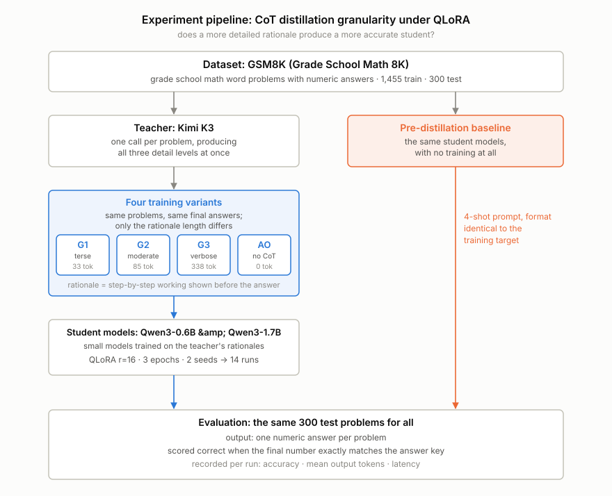
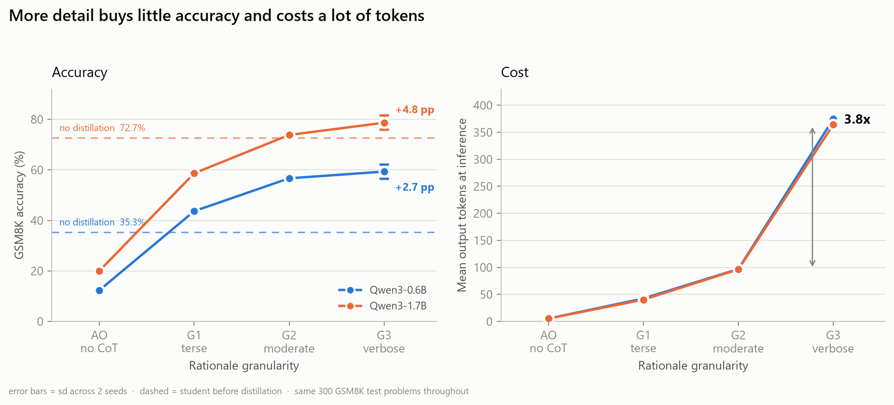

# Does Granularity Still Matter Under QLoRA?

Chain-of-thought distillation into small language models: an empirical study.

Two students (Qwen3-0.6B, Qwen3-1.7B), four rationale granularities, 14 QLoRA runs, GSM8K,
one Kaggle T4, 5.5 GPU-hours, $0 spent.

## The short version

Distillation is supposed to make small models better. I measured each student *before* distillation
too, a baseline most CoT distillation papers skip, and the picture changed.

For Qwen3-0.6B it worked as advertised: **+24.0 points**. For Qwen3-1.7B, which already scored 72.67%
untrained, **half the distilled configurations landed below the model I never trained at all**.
Answer-only fine-tuning cost 52.7 points. Terse chain-of-thought, a perfectly reasonable choice on
token cost, cost 14.0 points.

The granularity question itself came back a tidy null: accuracy rises with detail then flattens.
The gap between medium and maximum detail sits inside the between-seed spread while costing about
3.9x the output tokens.

## Background

Distilling Step-by-Step and SCOTT (both ACL 2023) set the standard recipe: have a large model write
rationales, then train a small model on them. Underneath sits an assumption that is rarely tested
directly, that more detailed explanations teach better. *Unveiling the Key Factors for Distilling CoT
Reasoning* (ACL Findings 2025) showed it fails for small models: the relationship is non-monotonic,
best in the middle rather than at either end.

Two gaps were still open.

**Gap 1: the fine-tuning regime.** Every existing granularity study uses full fine-tuning.
Practitioners use QLoRA, where only a small fraction of parameters can adapt. Whether the optimum
shifts under that constraint was untested.

**Gap 2: the missing baseline.** *Revisiting the Capacity Gap in CoT Distillation* (arXiv 2026)
observed that distillation papers compare configurations *after* distillation and never against the
student's own starting point. Cases where distillation makes a model worse are structurally
invisible.

## Pipeline

<picture>
  <source media="(prefers-color-scheme: dark)" srcset="results/figures/pipeline_en_dark.svg">
  
</picture>

Blue marks the independent variable: four training sets built from the same 1,455 problems and the
same gold answers, differing only in how long the rationale is. Orange marks the control: both
students evaluated with no training at all, on the same 300 problems.

## Setup

| | |
|---|---|
| Data | GSM8K, 1,455 train / 300 test, identical problems across all four variants |
| Teacher | `moonshotai/kimi-k3-free`, used once to generate data, then never again |
| Students | Qwen3-0.6B, Qwen3-1.7B |
| Training | QLoRA r=16, alpha=32, lr 2e-4 cosine, 3 epochs, effective batch 16 (273 steps), fp16 |
| Runs | 3 granularities x 2 students x 2 seeds, plus answer-only per student = 14 |
| Evaluation | Same 300 test problems, greedy decoding, exact match on the final number |

Rationale length by variant, measured with the student tokenizer: G1 33 tokens, G2 84.9, G3 338.3.
The levels separate cleanly with zero overlap (p90 of G1 sits below p10 of G2, p90 of G2 below p10 of
G3).

Three details that quietly break this experiment if left alone, each verified in code rather than
assumed:

- **`enable_thinking=False`.** Qwen3 emits a `<think>` block by default, which injects uncontrolled
  reasoning straight into the granularity axis.
- **Loss masked to the response.** Unmasked, answer-only's loss is dominated by question tokens while
  G3's is dominated by rationale, so the variants would differ for a reason unrelated to granularity.
- **fp16, not bf16.** `torch.cuda.is_bf16_supported()` returns `True` on a T4, which has no native
  bf16. Compute capability is the correct gate.

## Results

<picture>
  <source media="(prefers-color-scheme: dark)" srcset="results/figures/fig4_accuracy_and_cost_dark.png">
  
</picture>

Same x axis, two measures, so the trade is visible in one glance: the accuracy curve flattens between
G2 and G3 while the token curve climbs almost fourfold. Deliberately two panels rather than one plot
with two y-scales, since the alignment of two scales is arbitrary and invents a relationship the data
does not contain.

### Accuracy

| Student | Config | Accuracy (%) | sd | vs baseline |
|---|---|---:|---:|---:|
| **Qwen3-0.6B** | *no distillation* | *35.33* | | |
| | Answer-only | 12.33 | | **-23.00** |
| | G1 terse | 43.67 | 0.94 | +8.33 |
| | G2 moderate | 56.67 | 0.94 | +21.33 |
| | G3 verbose | 59.33 | 2.83 | +24.00 |
| **Qwen3-1.7B** | *no distillation* | *72.67* | | |
| | Answer-only | 20.00 | | **-52.67** |
| | G1 terse | 58.67 | 0.94 | **-14.00** |
| | G2 moderate | 73.83 | 1.18 | +1.17 |
| | G3 verbose | 78.67 | 2.83 | +6.00 |

sd is across 2 seeds. Answer-only ran one seed.

### Inference cost

| Student | Config | Output tokens | vs G2 | Acc / 100 tok | Tokens per correct answer |
|---|---|---:|---:|---:|---:|
| **Qwen3-0.6B** | *no distillation* | *87.4* | *0.90x* | *40.4* | *247.5* |
| | Answer-only | 5.4 | 0.06x | 228.4 | 43.8 |
| | G1 terse | 42.4 | 0.44x | **102.9** | **97.2** |
| | G2 moderate | 97.0 | 1.00x | 58.4 | 171.2 |
| | G3 verbose | 374.7 | **3.86x** | 15.8 | 631.5 |
| **Qwen3-1.7B** | *no distillation* | *115.9* | *1.20x* | *62.7* | *159.5* |
| | Answer-only | 5.4 | 0.06x | 369.0 | 27.1 |
| | G1 terse | 40.3 | 0.42x | **145.7** | **68.6** |
| | G2 moderate | 96.4 | 1.00x | 76.6 | 130.5 |
| | G3 verbose | 364.2 | **3.78x** | 21.6 | 462.9 |

The ranking inverts once cost is on the axis. G3 wins on raw accuracy and finishes last on every cost
measure. Read the efficiency columns next to the accuracy column, though: answer-only posts the best
tokens-per-correct-answer figure on the 1.7B purely because it emits 5 tokens and gets 20% of them
right.

## What this means

**RQ1, does the non-monotonic peak survive QLoRA?** No peak appeared. Accuracy rises then flattens
and never declines. But "G3 wins" overstates it: the G2 to G3 gap is +2.67 and +4.83 points against a
between-seed sd of 2.83, so the honest reading is that the curve **saturates at G2**. One plausible
mechanism is that limited LoRA adaptation capacity prevents a small student from overfitting to
verbose rationales in the first place. With two seeds this is a direction, not a settled result.

**RQ2, does the optimum shift with capacity?** No. Both students saturate around G2. What does change
with capacity is something I did not hypothesise: whether distillation is worth doing at all.

**RQ3, what does accuracy cost in tokens?** For any metered deployment, **G2 is the operating point**.
G3 costs about 3.9x the tokens to buy a gain that does not clear seed noise.

**The finding I did not predict.** For the 1.7B student, answer-only fine-tuning teaches a capable
model to skip reasoning it already had, and terse CoT lands 14 points below doing nothing. Report only
post-distillation numbers, as most papers do, and the table reads "most detail wins, terse loses",
which is coherent and hides entirely that half the pipeline destroyed value. The baseline costs zero
GPU time.

## Limitations

Two seeds, so most comparisons here are directional rather than significance-tested. One teacher, and
a frontier-class one, which interacts with the Small Model Learnability Gap literature. A narrow
capacity range: two model sizes is not a capacity curve. One benchmark, one language, one task family.

The evaluation token cap turned out to be a real experimental variable, and I got it wrong on the
first pass: a 512-token cap truncated G3 generations mid-sentence and cost up to 3.33 points. The
correction, what was re-measured and what was only argued, is documented in
[REPORT.md](REPORT.md#6-limitations) along with six other limitations.

## Reproduce

Notebooks run on Kaggle and are resumable: each writes incrementally and skips completed work, so a
session timeout costs nothing.

| Notebook | Accelerator | Produces |
|---|---|---|
| [`01_data_generation.ipynb`](notebooks/01_data_generation.ipynb) | None | `data/processed/`: G1, G2, G3, AO, test |
| [`02_training.ipynb`](notebooks/02_training.ipynb) | GPU T4 | 14 adapters, `results/results.csv` |
| [`03_analysis.ipynb`](notebooks/03_analysis.ipynb) | None, GPU for sections 5 and 6 | figures, tables, `results_v2.csv` |

Two gates stop the pipeline rather than let it produce a quietly wrong result. Notebook 01 refuses to
proceed unless the three granularity levels separate in token length and G3 fits inside
`max_seq_length`. Notebook 02 verifies loss masking took effect and that training and inference
formats match before training starts, so a mismatch fails in seconds instead of after 40 minutes.

Use [`results/results_v2.csv`](results/results_v2.csv) for every number.
`results.csv` is the first pass at the 512-token cap, kept for audit.

## Full write-up

[REPORT.md](REPORT.md) is the paper-style version: abstract, hypothesis-by-hypothesis results
including the two that were rejected, full discussion, nine limitations, and the original PRD kept
unedited so the gap between plan and execution stays on the record.
