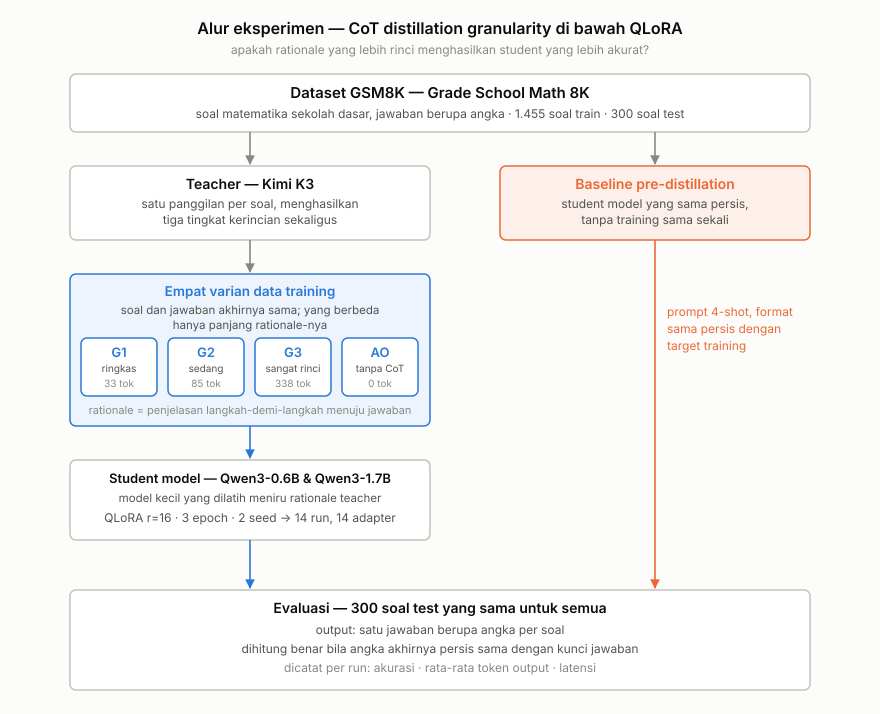
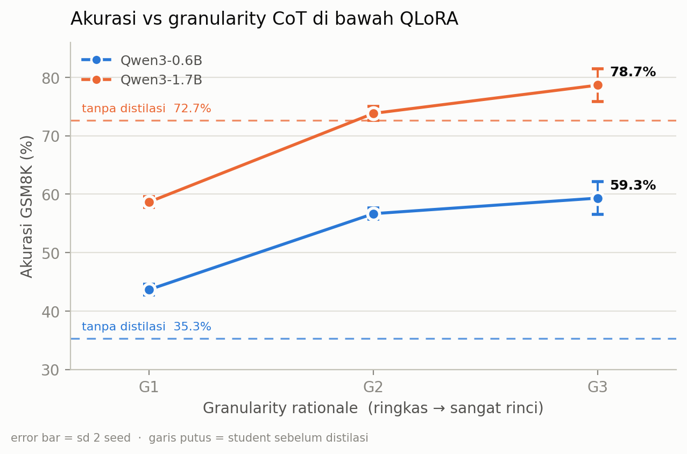
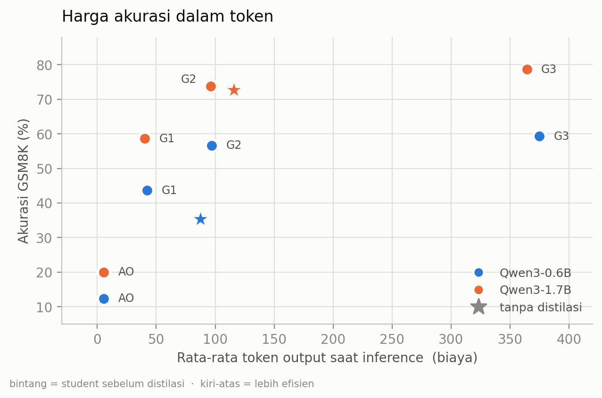
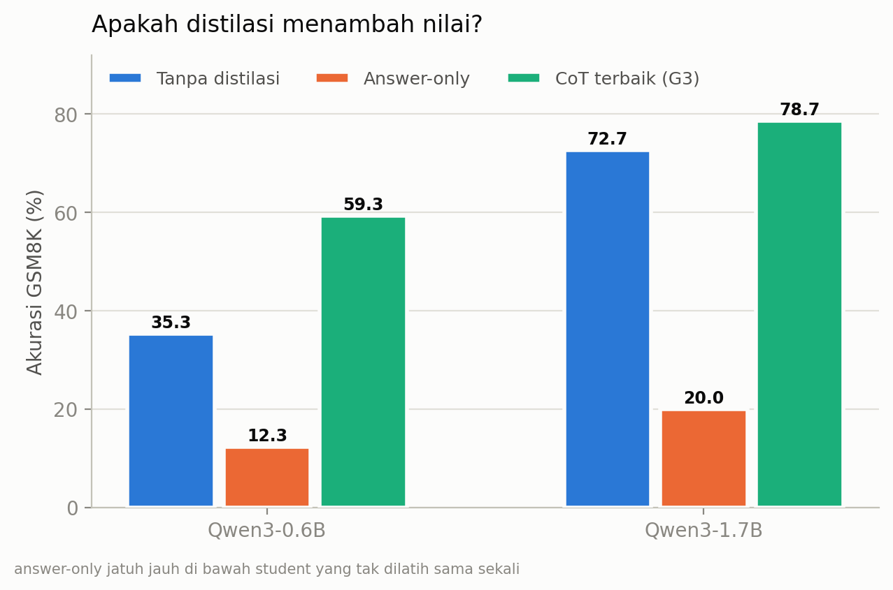

# Does Granularity Still Matter Under QLoRA?

**An empirical study of chain-of-thought distillation into small language models**

Two students (Qwen3-0.6B, Qwen3-1.7B) · four rationale granularities · 14 QLoRA runs · GSM8K
· one Kaggle T4 · 5.5 GPU-hours

---

## Abstract

Chain-of-thought distillation assumes that richer rationales teach small models better, and
2025 work has shown that assumption breaks for small language models under *full* fine-tuning,
where accuracy peaks at intermediate detail. We ask whether that curve survives the regime
practitioners actually use — QLoRA, where far fewer parameters can adapt — and we measure each
student *before* distillation, a baseline the literature routinely omits. Across 14 runs we find
no non-monotonic peak: accuracy rises with detail and then flattens, with the gap between medium
and maximum detail falling inside the between-seed spread while costing ~3.9× the output tokens.
The more consequential result comes from the missing baseline: for Qwen3-1.7B, half of the
distilled configurations scored **below the untrained model** — terse CoT at −14.0 points and
answer-only at −52.7 — while the two that helped gained only +1.2 and +6.0. Distillation's value collapsed as student capacity rose, and without a
pre-distillation baseline that collapse is invisible in the usual results table.

---

## 1. Background & Motivation

Distilling Step-by-Step and SCOTT (both ACL 2023) established the standard recipe: have a large
model produce rationales, then train a small model on them. Underneath sits an assumption that is
rarely tested directly — that more detailed explanations teach better. It holds for large models.
*Unveiling the Key Factors for Distilling CoT Reasoning* (ACL Findings 2025) showed it fails for
small ones: the relationship between granularity and accuracy is non-monotonic, optimal in the
middle rather than at either end.

Two gaps remained open, and this project targets both.

**Gap 1 — the fine-tuning regime.** Every existing granularity study uses full fine-tuning.
Practitioners overwhelmingly use QLoRA/LoRA, where adaptation capacity is a small fraction of the
model. Whether the optimum shifts under that constraint was untested.

**Gap 2 — the missing baseline.** *Revisiting the Capacity Gap in CoT Distillation* (arXiv 2026)
observed that distillation papers typically compare configurations *after* distillation, never
against the student's own pre-distillation performance. Cases where distillation makes a model
worse are therefore structurally invisible.

### Key references

| Paper | Venue | Relevance |
|---|---|---|
| Distilling Step-by-Step | ACL 2023 | Foundation; multi-task rationale + label |
| SCOTT: Self-Consistent CoT Distillation | ACL 2023 | Foundation; faithfulness objective |
| Unveiling the Key Factors for Distilling CoT Reasoning | ACL Findings 2025 | Source of the granularity axis; non-monotonic effect |
| Small Models Struggle to Learn from Strong Reasoners | ACL Findings 2025 | Small Model Learnability Gap |
| Revisiting the Capacity Gap in CoT Distillation | arXiv 2026 | Source of the baseline gap |
| Towards Efficient CoT Distillation (MoRSD) | EMNLP Findings 2025 | Rationale quality > quantity |

---

## 2. Research Questions

**RQ1** — Does the non-monotonic relationship between CoT granularity and student accuracy still
appear when fine-tuning with QLoRA instead of full fine-tuning?

**RQ2** — Does the optimal granularity shift with student capacity (0.6B vs 1.7B)?

**RQ3** — What does that accuracy cost in inference tokens? Which granularity is optimal on
*accuracy per token* rather than raw accuracy?

### Non-goals

Stated deliberately, as design decisions rather than omissions.

- **No new method or architecture.** This is a measurement study.
- **Teacher is not a variable.** One teacher is fixed throughout; making it a variable multiplies
  the run count. Reported as a limitation.
- **CoT *format* is not tested** (least-to-most, symbolic, …). 2025 work shows format has little
  effect on SLMs; granularity has a consistent one.
- **Rationale faithfulness is not tested.** It needs its own metric design.
- **No Indonesian-language extension.** See §8.

---

## 3. Setup

<picture>
  <source media="(prefers-color-scheme: dark)" srcset="results/figures/pipeline_dark.svg">
  
</picture>

Two things in this diagram carry the design. **Blue** marks the independent variable: four training
sets built from the same 1,455 problems and the same gold answers, differing only in how long the
rationale is. **Orange** marks the control the literature usually omits — both students evaluated with
no training at all, on the same 300 problems, which is what makes "did distillation help?" answerable
rather than assumed.

The diagram shows the pipeline as run. It omits one step for readability: the 1,455 training problems
are what survived teacher-correctness filtering of a 1,500-problem subsample (§3.1), and the bias that
filter introduces is quantified in Limitation 6.

### 3.1 Data

**GSM8K**, chosen because: final answers are numeric, so evaluation is exact-match with no LLM
judge and no added measurement noise; human rationales ship with it as a free comparison; the size
(7.4k/1.3k) subsamples comfortably; and it is the standard benchmark across this literature, so
results sit in context.

| Split | N | Role |
|---|---|---|
| Train | **1,455** | Student fine-tuning |
| Test | **300** | Final evaluation, from the official test split; see Limitation 5 |

1,500 problems were sampled and sent to the teacher; 1 call failed permanently and 44 were
filtered out (unparseable, or teacher's final answer ≠ gold), leaving 1,455 — a 97.0% yield.

### 3.2 The granularity axis

Four variants are built from **the same 1,455 problems**. Only the rationale changes.

| Variant | Structure | Mean tokens |
|---|---|---|
| **G1** | question → terse rationale → answer | 33.0 |
| **G2** | question → moderate rationale → answer | 84.9 |
| **G3** | question → highly detailed rationale → answer | 338.3 |
| **AO** | question → answer (no rationale) | 0 |

Measured with the student tokenizer. The levels are **cleanly separated with zero overlap**:
p90(G1)=52 < p10(G2)=56, and p90(G2)=119 < p10(G3)=258. Ratios are 2.57× and 3.98×.

> **The critical control:** identical problems across all four variants. Without it, the experiment
> measures problem selection, not granularity.

Three further controls are verified in code rather than assumed:
- All four variants carry the same problems, in the same order, with the same gold answers.
- Zero train/test overlap; the test split is byte-identical to the raw subsample.
- Every training target is built by **one** function, so the only difference between variants is the
  rationale string.

### 3.3 Models

| Role | Model |
|---|---|
| Teacher | `moonshotai/kimi-k3-free` (2.8T MoE) via TokenRouter — used once, then never again |
| Student A | Qwen3-0.6B |
| Student B | Qwen3-1.7B |

Two student sizes, because the finding worth reporting is not "G2 is best" but whether a weak and a
strong student behave differently. With one student there is no contrast to show.

### 3.4 Training configuration

Locked identically across all 14 runs. This is a control variable, not a tuning surface.

```
Framework       : Unsloth 2026.8.9 + TRL SFTTrainer
Quantization    : 4-bit (QLoRA)
LoRA            : r=16, alpha=32, dropout=0
Target modules  : q,k,v,o,gate,up,down proj
Learning rate   : 2e-4, cosine, warmup 8 steps
Epochs          : 3            (1455 / 16 = 91 steps per epoch -> 273 steps per run)
Batch           : 2 x grad_accum 8 = effective 16
Max seq length  : 1024
Precision       : fp16         (T4 is Turing; no native bf16)
Grad checkpoint : "unsloth"
Hardware        : Kaggle Tesla T4, pinned to a single GPU
```

Two details that silently change the experiment if left alone:

- **`enable_thinking=False`.** Qwen3 emits a `<think>` block by default. Left on, it injects
  uncontrolled reasoning that contaminates the granularity axis. A gate verifies the block is empty
  in every training target and inference prompt.
- **Loss is masked to the response** (`train_on_responses_only`). Unmasked, AO's loss is dominated
  by question tokens (72 of 110) while G3's is dominated by rationale — the variants would differ
  for a reason unrelated to granularity. The mask is verified to have taken effect before each run
  starts, not assumed.

### 3.5 Evaluation

All models are evaluated on the same 300 test problems: greedy decoding, exact match on the final
number, with accuracy, mean output tokens, and per-item latency recorded.

The **pre-distillation baseline** is each student evaluated 4-shot with no training at all, using
G2 examples in exactly the training target format so the comparison is not about formatting.

---

## 4. Results

<picture>
  <source media="(prefers-color-scheme: dark)" srcset="results/figures/fig1_accuracy_vs_granularity_dark.png">
  
</picture>

| Student | Variant | Accuracy (%) | sd | Output tokens | Acc / 100 tok | vs baseline |
|---|---|---|---|---|---|---|
| **Qwen3-0.6B** | *no distillation* | *35.33* | — | *87.4* | *40.4* | — |
| | AO | 12.33 | — | 5.4 | 228.4 | **−23.00** |
| | G1 | 43.67 | 0.94 | 42.4 | 102.9 | +8.33 |
| | G2 | 56.67 | 0.94 | 97.0 | 58.4 | +21.33 |
| | G3 | 59.33 | 2.83 | 374.7 | 15.8 | +24.00 |
| **Qwen3-1.7B** | *no distillation* | *72.67* | — | *115.9* | *62.7* | — |
| | AO | 20.00 | — | 5.4 | 369.0 | **−52.67** |
| | G1 | 58.67 | 0.94 | 40.3 | 145.7 | **−14.00** |
| | G2 | 73.83 | 1.18 | 96.4 | 76.6 | +1.17 |
| | G3 | 78.67 | 2.83 | 364.2 | 21.6 | +6.00 |

sd is across 2 seeds; AO ran one seed. Full per-run records: [`results/results_v2.csv`](results/results_v2.csv).

### Inference cost

The ranking inverts once cost is on the axis. "Tokens per correct answer" is the practical figure:
how many output tokens you spend to obtain one right answer.

| Student | Config | Output tokens | vs G2 | Accuracy (%) | Acc / 100 tok | Tokens per correct answer |
|---|---|---:|---:|---:|---:|---:|
| **Qwen3-0.6B** | *no distillation* | *87.4* | *0.90×* | *35.33* | *40.4* | *247.5* |
| | AO | 5.4 | 0.06× | 12.33 | 228.4 | 43.8 |
| | G1 | 42.4 | 0.44× | 43.67 | **102.9** | **97.2** |
| | G2 | 97.0 | 1.00× | 56.67 | 58.4 | 171.2 |
| | G3 | 374.7 | **3.86×** | 59.33 | 15.8 | 631.5 |
| **Qwen3-1.7B** | *no distillation* | *115.9* | *1.20×* | *72.67* | *62.7* | *159.5* |
| | AO | 5.4 | 0.06× | 20.00 | 369.0 | 27.1 |
| | G1 | 40.3 | 0.42× | 58.67 | **145.7** | **68.6** |
| | G2 | 96.4 | 1.00× | 73.83 | 76.6 | 130.5 |
| | G3 | 364.2 | **3.78×** | 78.67 | 21.6 | 462.9 |

G3 wins on raw accuracy and finishes last on every cost measure: 3.8× G2's tokens for a gain inside
the between-seed spread, and 3.5× the tokens per correct answer.

The efficiency column is only readable next to the accuracy column. Answer-only posts the best
tokens-per-correct-answer figure on the 1.7B (27.1) purely because it answers 5 tokens at a time and
gets 20% of them right. G1 looks similarly efficient there — and is 14 points below an untrained
model. Cheap is not the same as worth running.

Latency was recorded per run but is **not comparable across variants**: the G3 re-evaluation used a
different batch size (see Limitation 4). Output tokens are the hardware-independent cost measure, and
every cost claim above uses them.

<picture>
  <source media="(prefers-color-scheme: dark)" srcset="results/figures/fig2_token_cost_dark.png">
  
</picture>

<picture>
  <source media="(prefers-color-scheme: dark)" srcset="results/figures/fig3_baseline_dark.png">
  
</picture>

---

## 5. Discussion

### RQ1 — the non-monotonic peak did not appear under QLoRA

Accuracy rises with granularity and then flattens; it never declines. Neither student peaks at
intermediate detail.

But "G3 wins" overstates it. The G2→G3 gap is **+2.67 points (0.6B)** and **+4.83 points (1.7B)**,
against a between-seed sd of 2.83 in both G3 conditions — inside the seed spread. The defensible
reading is that **the curve saturates at G2 and G3 is not distinguishable from it**, not that more
detail keeps helping.

This is the outcome the study was designed to be able to report: it suggests the non-monotonic
effect documented under full fine-tuning may not transfer to LoRA, where limited adaptation
capacity plausibly prevents a small student from overfitting to verbose rationales in the first
place. With two seeds this is a direction, not a settled result.

### RQ2 — no capacity-dependent shift

Both students peak nominally at G3, and both saturate around G2. We found no evidence that the
optimum moves with capacity in the 0.6B–1.7B range. What *does* change with capacity is something
we did not hypothesise: the value of distillation itself.

### RQ3 — the token-efficiency picture inverts the ranking

On accuracy per 100 output tokens, the ordering is the reverse of raw accuracy:

| | G1 | G2 | G3 |
|---|---|---|---|
| Qwen3-0.6B | **102.9** | 58.4 | 15.8 |
| Qwen3-1.7B | **145.7** | 76.6 | 21.6 |

G3 costs ~3.9× G2's tokens to buy a gain that does not clear seed noise. For any deployment where
inference is metered, **G2 is the operating point**, and G1 is 1.8× more token-efficient still if
its accuracy is acceptable.

### The finding we did not predict

The pre-distillation baselines are the most consequential numbers in the table.

For **Qwen3-0.6B**, distillation works as advertised: +24.0 points at best. The student cannot do
multi-step arithmetic on its own and CoT supervision genuinely teaches it.

For **Qwen3-1.7B**, two of four configurations land **below the untrained model**. Answer-only
fine-tuning costs 52.7 points — it teaches a capable model to skip reasoning it already had. Terse
CoT costs 14.0. The two that do help, G2 (+1.2) and G3 (+6.0), buy margins small relative to the
effort — and G2's is within a point of noise.

The value of distillation collapsed as student capacity rose. This is consistent with the Small
Model Learnability Gap literature, and it is exactly the failure mode that Gap 2 predicts stays
hidden: report only post-distillation numbers and the table reads "G3 best, G1 worst" — a
coherent-looking result that conceals the fact that most of the pipeline destroyed value.

---

## 6. Limitations

Specific, and stated because each one bounds a claim above.

1. **Two seeds.** Standard deviations from n=2 are thin. Every "within seed spread" statement here
   is a direction, not a significance test. AO ran a single seed and has no sd at all.
2. **One teacher, and a frontier-class one.** `kimi-k3-free` (2.8T MoE) is far stronger than the
   ~70B teacher this study was originally scoped around. The literature we cite warns that stronger
   teachers can produce rationales a small student learns *worse* from, so the absolute numbers may
   shift with a weaker teacher. The teacher is constant across all 14 runs, so the granularity
   comparison itself is unaffected.
3. **The evaluation token cap is a real variable, and we got it wrong first.** An initial cap of 512
   truncated G3 generations mid-sentence; the parser then fell back to the last number in the text
   (an intermediate calculation) and scored them wrong. Re-evaluating G3 at 1024 raised accuracy by
   up to 3.33 points. Residual truncation at 1024 is 0.3–2.0%, which bounds the remaining accuracy
   error below the between-seed sd. `eval_max_new` and `truncated_frac` record this per run.

   **Only the four G3 runs were re-evaluated, and the other twelve were not re-measured.** The
   argument for that scoping is that greedy decoding terminates on its own, so a higher cap cannot
   change a generation that already emitted EOS — and the other variants average 5–97 output tokens,
   far below even the 512 cap. That argument is not the same as a measurement: `truncated_frac` is
   `NaN` for every run we did not re-run, rather than 0, precisely so it is not mistaken for one. The
   direct evidence we do have covers two of those twelve runs (0.6B G2 and 0.6B AO, 50 test items
   each), both at 0% parser fallback under the 512 cap. Individual truncations elsewhere cannot be
   ruled out, though any would have to come from a degenerate non-terminating generation.

4. **The two measurement passes are not identical beyond the token cap.** G3's corrected numbers were
   produced with evaluation batch size 8 and without pinning `CUDA_VISIBLE_DEVICES`; every other run
   used batch size 16 on a single pinned GPU. Batched greedy decoding with left padding is not
   guaranteed bit-identical across batch sizes, since padding changes attention numerics. The G3
   versus G2 comparison therefore spans two configurations that differ in more than the one variable
   we intended to change. We expect the effect to be small but did not measure it.

5. **The test split was touched during development,** contrary to the protocol in §3.1. The smoke run
   that verified the training pipeline evaluated on the first 50 test problems, and the generation
   dump reused the same 50. No hyperparameter, prompt, or configuration was changed as a result —
   every such decision was locked before those numbers were read — so we treat the effect as nil, but
   the protocol as written was not followed.
6. **Teacher-correctness filtering biases the training set toward easier problems.** The 45 dropped
   items skew longer (median 48 vs 42 words) and higher-magnitude (median answer 56 vs 42). Every
   CoT distillation pipeline filters this way; few measure the shift. n=45, so this is a tendency,
   not a strong claim.
7. **1,455 training examples, not the planned 1,500** — a consequence of the 97% teacher yield.
8. **One benchmark, one language, one task family.** GSM8K is grade-school arithmetic in English.
   Nothing here transfers automatically to other reasoning domains.
9. **Granularity is operationalised by prompt, not by a formal metric.** G1/G2/G3 are what the
   teacher produced under three instructions; the levels are verified to be separated in token
   length, but "detail" is not measured independently of length.

---

## 7. Future Work

- **Indonesian extension.** The strongest differentiator available, deliberately cut. Translating
  and validating 1,800 math problems costs 3–4 days and introduces translation quality as a
  confound — if results came out strange, granularity and translation artifacts would be
  inseparable. It belongs in a v2 with its own validation, not bolted onto this one.
- **More seeds**, enough to make the G2-vs-G3 comparison a test rather than a direction.
- **Teacher as a variable**, to probe the learnability-gap interaction directly instead of noting it.
- **Wider capacity range.** The 0.6B→1.7B jump already flips distillation from strongly positive to
  roughly neutral; where it crosses zero is the interesting question.
- **Error taxonomy** over `results/generations_sample.jsonl` — are the failures arithmetic slips or
  reasoning breakdowns, and does that mix shift with granularity?

---

## 8. Reproduction

Run on Kaggle. Notebooks are resumable: each writes incrementally and skips completed work, so a
session timeout costs nothing.

| Notebook | Accelerator | Needs | Produces |
|---|---|---|---|
| [`01_data_generation.ipynb`](notebooks/01_data_generation.ipynb) | None | Internet ON, `TOKENROUTER_API_KEY` secret | `data/processed/` — G1, G2, G3, AO + test |
| [`02_training.ipynb`](notebooks/02_training.ipynb) | GPU T4 | dataset from 01 | 14 adapters + `results/results.csv` |
| [`03_analysis.ipynb`](notebooks/03_analysis.ipynb) | None (§1–4) / GPU (§5–6) | results + adapters | figures, tables, `results_v2.csv` |

Two gates will stop the pipeline rather than let it produce a quietly wrong result:

- **Notebook 01** refuses to proceed unless the three granularity levels are separated in token
  length (mean ratios > 1.5×) and G3 fits inside `max_seq_length` — running 14 runs on a variable
  that does not exist is the expensive failure.
- **Notebook 02** verifies loss masking took effect and that train and inference formats match
  before training starts, so a mismatch fails in seconds instead of after 40 minutes.

```
├── PRD-cot-distillation-granularity.md   # original design doc (see note below)
├── data/
│   ├── raw/            # GSM8K subsample
│   ├── generated/      # teacher output, 3 levels
│   └── processed/      # G1, G2, G3, AO ready for training
├── notebooks/          # 01 data · 02 training · 03 analysis
├── prompts/            # granularity_prompt.txt
└── results/
    ├── results_v2.csv          # every run, every metric (use this one)
    ├── results.csv             # first pass, 512-token eval cap — superseded, kept for audit
    ├── summary_table.csv
    ├── generations_sample.jsonl
    └── figures/
```

> The PRD is kept as written, not retrofitted. It specifies Google Colab, a Llama-3.3-70B teacher,
> and 1,500 training examples; the study actually ran on Kaggle with a Kimi-K3 teacher and 1,455
> examples. The gap between plan and execution is part of the record.

---

## Compute

14 training runs + evaluation: **5.5 GPU-hours** on a single Tesla T4. G3 alone accounts for
roughly half — it costs ~4× the tokens per epoch of any other variant. Teacher generation: 1,500
calls on a free-tier endpoint. Total cash cost: **$0**.
